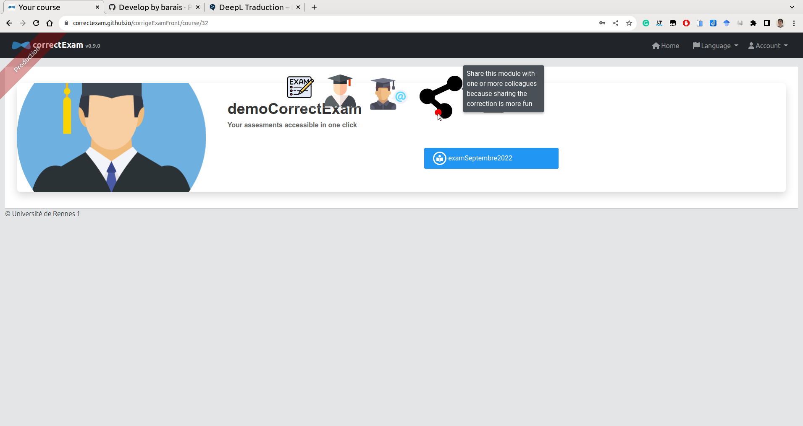

# How to ?

##  For users

### How to create an account on the platform?

You can go to the [platform](https://correctexam.github.io/corrigeExamFront/), click on **register**, fill in some information. You will receive an email to validate your account. 


You can then fill in your account information in the menu. *Account* -> *Settings*

### How to create a module?

Once authenticated, on the main page, click on the **+** symbol *create a course*.
It is required to give a name to a module. 


### Can I share a correction with one or more colleagues?

When you click on the module, you will have access in the list of actions to a shared action that allows you to share this module with one or more colleagues. These colleagues will then see this module in the list of their modules. 




### Can I limit the rights of a colleague so that he can only access a subset of the questions?

No, a colleague, we can trust him ;). We do not implement any specific RBAC rules per exam. 

### Do you have a diagram of the main steps to do to use this application?


### How to create an exam?

To create an exam, once you enter the page of a module, it is possible to create a new exam with the command carousel. 

### Where can I find some templates for Word latex and libreoffice?

In the view that allows you to create an exam, you have access to a number of templates to create your exam. The philosophy of the application is to let each teacher create his exam with the tool he likes. 

### Why am I forced to upload a list of students?

To correct, we associate each answer key with a student. This list is required to do the assignment task.

### Do I have to delete a student who did not compose? 

No, it will be marked as ABI by default. 

### Can you explain the different types of questions that are available?

For the moment, there are roughly four types of questions. 

- **MCQs** for which the application provides marking assistance. 
- The **DIRECT** scoring (*Manual and Direct*) for which the teacher manually scores the answers to this question. 
- **POSITIVE** scoring (*Manual and POSITIVE*). This remains an element for which the teacher can define a set of comments along the way that gives points to the answers for this question (we start from zero). The total number of points obtained cannot exceed the maximum number of points associated with this question.
- The **NEGATIVE** notation (*Manual and NEGATIVE*). This is an element for which the corrector can define a set of comments along the way that removes points from the answer in question (we start from the maximum number of points possible for this question). The total number of points obtained cannot go below zero.

These types of questions will be enriched in the future. Please provide your great idea. 

### Can I change the type of question when the correction of a question has started?

Honestly, not recommended because not tested. 

### How to clean the students' scan if pages are missing, duplicate page, flipped page...?

Use [pdfarranger](https://github.com/pdfarranger/pdfarranger). It is great tool for this task. 

### Can I reload a clean scan (see previous question) and realign it if I already start to correct an exam?

Yes, no problem, if you share the correction with colleagues or with different devices, you can force the upload and download to the server later. 

### What happens if my template has an odd number of pages (*e.g.* 3 pages) and the scan of the student sheets is a multiple of 2 (*e.g.* 4 page per student)

For the moment, it is not managed correctly at the moment of the alignment. It will be necessary to remove the blank pages from the student scans beforehand with pdf manipulation tools like [pdftk](https://www.pdflabs.com/tools/pdftk-the-pdf-toolkit/) or [pdfarranger](https://github.com/pdfarranger/pdfarranger).

### Can I test an instance of this application on my own infrastructure/laptop (I want to keep my data private) ?

Yes please go to the documentation for developers. We provide scripts to deploy this application on any type of infrastructure from a powerful server with K8S to a raspberry 4. 

You can also easily test it locally. You just need docker. 

```bash
git clone -b develop https://github.com/correctexam/corrigeExamBack
cd corrigeExamBack/src/main/docker
docker-compose -f app.yml build --no-cache  back front
docker-compose -f app.yml up
```

the application is then available on [http://localhost:9000](http://localhost:9000)
the phpmyadmin part is available on [http://localhost:91](http://localhost:91)
the fake mail server part is available on [http://localhost:9000/maildev/](http://localhost:9000/maildev/)

For information:

1. If you want to connect to a real mail server type share. you can have an overview of the quarkus properties as a comment in the *app.yaml* file.

2. If you want to change the ports
  
- for phpadmin,
  - for the host port you have to change it in the *app.yml* file  
  - for the internal port, you have to change it both in the *app.yml* file and the *myadmin.conf* file (nginx container file)
- for the application
  - for the host port, you have to change it in the app.yml.
  - for the internal port, you have to change it in the app.yml and in the exam.conf file (file of the nginx container) for the front and update the quarkus properties if you want to change the internal port of the back (no real reason)

1. If you want to set up reverse proxy according to a domain name, everything will happen in the files *exam.conf* and *myadmin.conf* but there is also to update the external url in the application, it's a quarkus property in the app.yml file. 


### How do I scan students' sheets?

We recommend using grayscale at 150 DPI to keep the file size reasonable but no problem with a color scan at 300 DPI if necessary. Avoid pure black and white which could be detrimental to the algo that recognizes names/first names/ids (INE) of students


### Can I compose a statement with another tool than word, excel or latex?

Of course, the only important point is a circle marker in the corners to facilitate alignment and light gray squares to put the names, first names and ids (INE) of students. 

### What to do when I encounter a bug in the application?

Use the github ticket system on the project https://github.com/correctexam/corrigeExamFront

##  For developers

### how to contribute ?

We try to follow a gitflow workflow to integrate new contributions. 
Do not hesitate to read the [gitflow documentation](https://git-flow.readthedocs.io/fr/latest/presentation.html) and do pull request. 
We are welcome to external contributions so do not hesitate even if you are not sure of your new contributions 😀. 
 
Read the [following guide](/) to setup your own development environment. 

### how to setup  your own development environment?

Read the [following guide](/) to setup your own development environment. 
