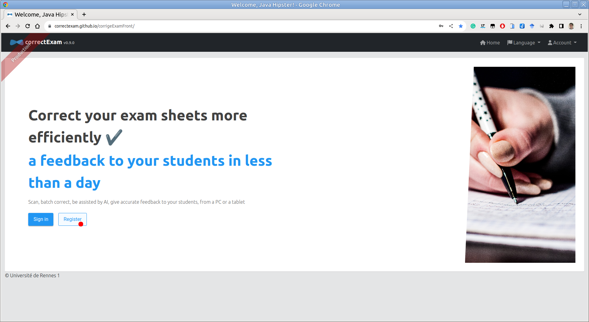
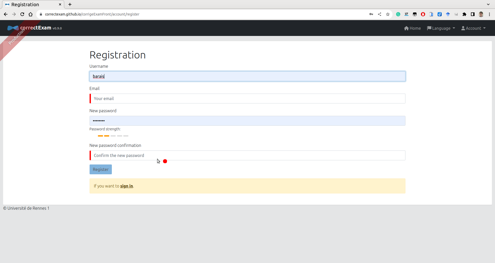
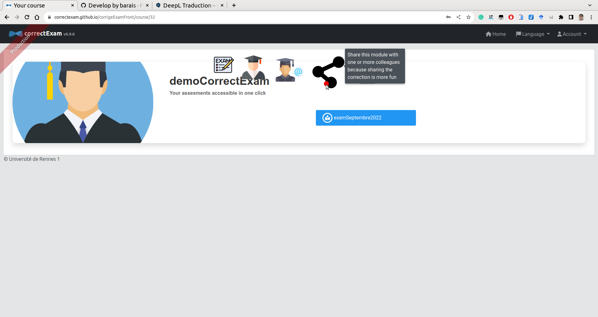
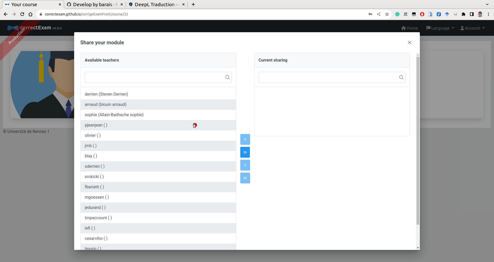
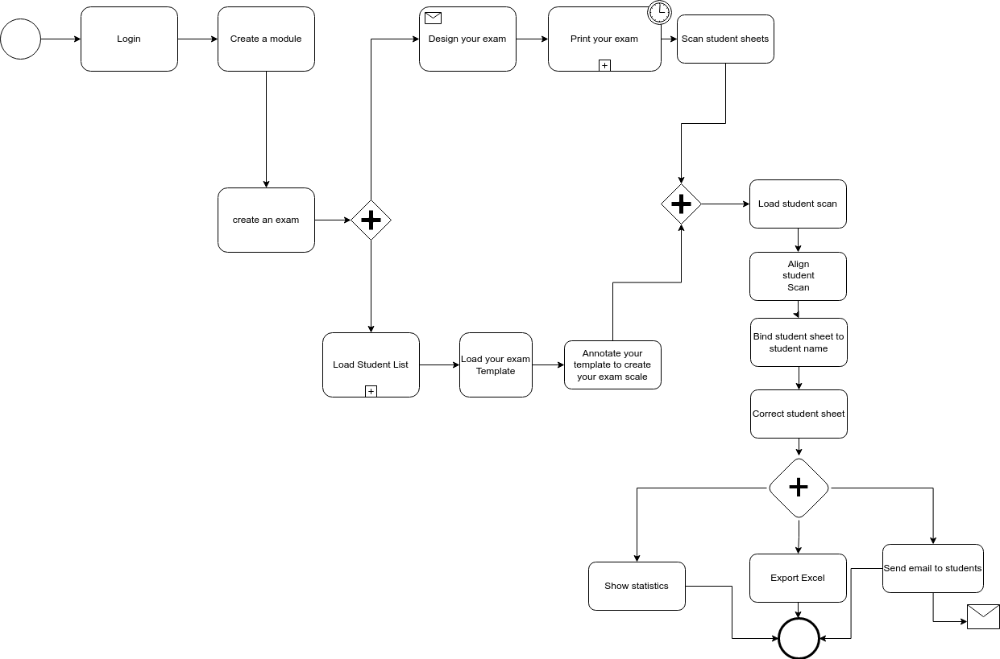

(user1)=

# The main stages to achieve to evaluate an exam

The main stages of exam marking are as follows

0. Create an account on the platform ?
1. Create a course and an exam (this includes creating your exam using a word processor (word, google doc, libreoffice) or latex ;) and upload the list of students who can take the exam.
2. Create your marking scheme (how each question will be graded, typical comments per question, ...)
3. Load scans of exam papers in the right order
4. Straighten your scans
5. Associate each copy with a student (assisted by AI)
6. Correct copies (question by question or student by student or any other combination)
7. Look at the statistics associated with passing the exam to potentially adjust the grading a little.
8. Send feedback to students
9. Export grades in excel format for transmission to school department

## Demo

A demonstration video is available [here](https://www.youtube.com/watch?v=bYTBlTg37RM&t) in French.

## Step 0: How do I create an account on the platform?

You can go to the [platform](https://correctexam.github.io/corrigeExamFront/), click on **register**, fill in a few details. You will receive an e-mail to validate your account.

You can then fill in your account information in the menu. *Account* -> *Settings* menu

## Step 1: Create your course and exam (This includes creating your exam using a word processor (word, google doc, libreoffice) or latex ;)

Once logged in, on the home page, click on the **+** symbol *create a course*.
You need to give the course a name.

If you'd like to correct with several people, when you click on the module, you'll have access to a shared action in the action list, enabling you to share this module with one or more colleagues. These colleagues will then see the module in their list of modules.

To create an exam, once you've entered the module page, you can use the (+) command to create a new exam or import an existing one. In the view that allows you to create an exam, you have access to a number of templates for creating your exam. The application's philosophy is to allow each teacher to create his or her own exam with the tool that suits them best.

It is then necessary to load the list of students in this module. To correct, we associate each answer key with a student. This list is needed to perform the assignment task. (In the worst case, if you don't want any names, you can always associate them with numbers entered on the copy and a list of students with names such as student1/student2, etc.).

:::{note}
For Univ Rennes, this list is available here: https://mdw.univ-rennes1.fr/
:::

## Step 2: Create your grading scale (how each question will be graded, typical comments per question, etc.)

To create your marking scheme, once you've entered the page for a module, then for the exam in question, you have access to an annotate template button. This is where you define all the zones of interest, as well as the scale for each question. 
You need zones of interest with last name, first name and/or student number. 
You also need zones of interest that define the areas in which the student will answer each of the questions asked. 

### Understanding the different question types

For the moment, there are roughly four types of question. 

- Direct questions. The **DIRECT** notation (*Manual and Direct*) for which the teacher manually scores the answers to this question, assigning a mark to each student for this question. 
- Positive questions. POSITIVE** notation (*manual and POSITIVE*). This is an item for which the teacher can define a set of comments along the way that gives points to the answers to this question (starting from zero). The total number of points obtained cannot exceed the maximum number of points associated with this question.
- Negative questions. The **NEGATIVE** notation (*Manual and NEGATIVE*). This is an element for which the marker can define a set of comments along the way, which removes points from the answer in question (the starting point is the maximum number of points possible for this question). The total number of points obtained cannot be less than zero.
- The **QCM** for which the application provides scoring assistance.

:::{note}
Comments associated with a question can be defined here or during correction in the correction view.
:::

### How the scoring system works with different question types

For each question, you'll need to define the question number, the total number of points and a notion of *steps*. The question number can be the same for several questions (if, for example, the answer zone is located on two separate pages). The number of points corresponds to the maximum score for that question. The notion of *steps* defines the possible increment per point. 

- For example, an answer to a two-point **DIRECT** question with a step of 4 can be marked from 0.25 to 0.25, i.e. 0; 0.25; 0.5; ...; 1.75 or 2. 

- For example, an answer to a question of the **POSITIVE** type on two points with a step of 4 will make it possible to define comments that will add points worth 0; 0.25; 0.5; ...; 1.75 or 2. Note that even if two positive comments result in a total score greater than 2, the score will be reduced to 2, the maximum value for the question.
- For example, an answer to a **NEGATIVE** question on two points with a step of 4 will allow you to define comments that will remove points worth 0; -0.25; -0.5; ...; -1.75 or -2. Even if two negative comments result in a total score of less than 0, the score will be reduced to 0, the minimum value for the question. If no negative comments are applied, the student receives the maximum mark for this question, i.e. in our example 2. 
- For example, for an answer to a **QCM** question, it will be necessary to give all valid answers. If the student's answer is valid, he/she will receive the maximum mark for the question. If the answer is not valid, he/she will for the moment have the penalty which is defined at the time of the scale as - 1/10; - 1/8; - 1/6; ...; -1/2; -1 or 0 * the maximum mark. If the student has left a blank, he will get 0 for the question. So if you set the number of points to 2, the penalty is 1/4. If the student got it right, he gets 2 points; if he got it wrong, he gets -0.5; if he didn't answer, he gets 0.

## Step 3: Load scans of correctly ordered exam papers

The next step is to load the student copies into the application. We recommend using grayscale at 150 DPI to keep the file size reasonable, but there's no problem with a color scan at 300 DPI if necessary. Avoid pure black and white, which could interfere with the algorithm that recognizes students' names/first names/identifiers (INE) in the next step.

:::{attention}
The scan must arrive in **ONLY ONE PDF FILE**. It must be **clean**, i.e. no missing page(s), no page(s) in the wrong order. The application does not provide a mechanism to improve scans after import.
:::

Use [pdfarranger](https://github.com/pdfarranger/pdfarranger). This is an excellent tool for cleaning up student scans.

:::{tip}
Staple the student copies before the students compose. Ask them not to remove the staples. Use a paper cutter to remove staples before scanning your copies. 
:::

## Step 4. Straighten your scans

Now it's time to run the image alignment process to eliminate any distortion caused by scanning the copies. If you have marks (black circles) at the four corners of the copies, use alignment with mark, otherwise without mark it will take longer. If you don't have any MCQs and your scanner doesn't distort the copies very much, you can also choose not to straighten the copies. 

You can ask to realign only part of the copies by selecting the pages to be realigned. This allows you to see in particular the point at which it has made its alignment. This is sometimes useful to understand why the alignment is going wrong. 

## Step 5: Associate each copy with a student (AI-assisted)

The next step is to associate each copy with a student from the student list. It is possible to filter the students already assigned to a copy. 

At the end of this stage, if you have correctly assigned all the copies, you can move on to the correction phase. If not, it's probably because a copy has not yet been assigned. 

## Step 6: Correct copies (question by question or student by student or any other combination)

We now enter the correction phase. On the same or another piece of equipment (e.g. a tablet), you can correct copies (question by question or student by student). You can annotate the image with a pencil, add comments, set a grade, automatically correct MCQs, etc.

A dashboard lets you see the progress of the correction. 

If you are correcting on a computer and not on a tablet, there are keyboard shortcuts for efficient navigation, or you can define your own keyboard shortcuts to apply or remove predefined comments. Press *F1* to review existing keyboard shortcuts. 

During this phase, it's a good idea to tag "excellent" answers and "outstanding" wrong answers. This automatically creates an answer sheet for the students, and allows these remarkable wrong answers to be discussed anonymously with the students later on.

## Step 7: View the statistics associated with passing the exam to potentially adjust the grading slightly

During or at the end of marking, you can view the statistics associated with this exam in the **see results** view, in order to adjust the grading, for example, by modifying the value associated with comments for **POSITIVE** or **NEGATIVE** grading. For **DIRECT** grading, it will not be possible to modify the grading after marking, and it will therefore be necessary to go through all the papers again if you wish to change the grading.

## Step 8: Sending feedback to students

Once the correction has been completed correctly, you can use the **see results** view to send copies to students. Students will receive a unique link to consult their copy, and will be able to view the answers tagged excellent anonymously. The sending e-mail can be configured just before sending. 

:::{warning}
If you've graded your answers, they will not be graded on the online instance, but on an instance installed on your own machine. You'll need to export the module and re-import it onto the main platform or that of your establishment for the mail sending to work correctly. 
:::

:::{note}
This stage of transmission to students is not compulsory. It's the tool's primary motivation, but the tool can just be used to evaluate without seeking to give systematic feedback to students. 
:::

## Step 9: Export grades in Excel format for transmission to school authorities

Finally, it is possible to export grades in Excel format for transmission to school authorities. 

# Frequently asked questions for users

## How to create an account on the platform?

You can go to the [platform](https://correctexam.github.io/corrigeExamFront/), click on **register**, fill in some information. You will receive an email to validate your account. 

You can then fill in your account information in the menu. *Account* -> *Settings*

## How to create a module?

Once authenticated, on the main page, click on the **+** symbol *create a course*.
It is required to give a name to a module. 

## Can I share a correction with one or more colleagues?

When you click on the module, you will have access in the list of actions to a shared action that allows you to share this module with one or more colleagues. These colleagues will then see this module in the list of their modules. 

## Can I limit the rights of a colleague so that he can only access a subset of the questions?

No, a colleague, we can trust him ;). We do not implement any specific RBAC rules per exam. 

### Do you have a diagram of the main steps to do to use this application?

## How to create an exam?

To create an exam, once you enter the page of a module, it is possible to create a new exam with the command carousel. 

## Where can I find some templates for Word latex and libreoffice?

In the view that allows you to create an exam, you have access to a number of templates to create your exam. The philosophy of the application is to let each teacher create his exam with the tool he likes. 

## Why am I forced to upload a list of students?

To correct, we associate each answer key with a student. This list is required to do the assignment task.

## Do I have to delete a student who did not compose? 

No, it will be marked as ABI by default. 

## Can you explain the different types of questions that are available?

For the moment, there are roughly four types of questions. 

- **MCQs** for which the application provides marking assistance. 
- The **DIRECT** scoring (*Manual and Direct*) for which the teacher manually scores the answers to this question. 
- **POSITIVE** scoring (*Manual and POSITIVE*). This remains an element for which the teacher can define a set of comments along the way that gives points to the answers for this question (we start from zero). The total number of points obtained cannot exceed the maximum number of points associated with this question.
- The **NEGATIVE** notation (*Manual and NEGATIVE*). This is an element for which the corrector can define a set of comments along the way that removes points from the answer in question (we start from the maximum number of points possible for this question). The total number of points obtained cannot go below zero.

These types of questions will be enriched in the future. Please provide your great idea. 

## Can I change the type of question when the correction of a question has started?

Honestly, not recommended because not tested. 

## How to clean the students' scan if pages are missing, duplicate page, flipped page...?

Use [pdfarranger](https://github.com/pdfarranger/pdfarranger). It is great tool for this task. 

## Can I reload a clean scan (see previous question) and realign it if I already start to correct an exam?

Yes, no problem, if you share the correction with colleagues or with different devices, you can force the upload and download to the server later. 

## What happens if my template has an odd number of pages (*e.g.* 3 pages) and the scan of the student sheets is a multiple of 2 (*e.g.* 4 page per student)

For the moment, it is not managed correctly at the moment of the alignment. It will be necessary to remove the blank pages from the student scans beforehand with pdf manipulation tools like [pdftk](https://www.pdflabs.com/tools/pdftk-the-pdf-toolkit/) or [pdfarranger](https://github.com/pdfarranger/pdfarranger).

## How do I scan students' sheets?

We recommend using grayscale at 150 DPI to keep the file size reasonable but no problem with a color scan at 300 DPI if necessary. Avoid pure black and white which could be detrimental to the algo that recognizes names/first names/ids (INE) of students

## Can I compose a statement with another tool than word, excel or latex?

Of course, the only important point is a circle marker in the corners to facilitate alignment and light gray squares to put the names, first names and ids (INE) of students. 

## What to do when I encounter a bug in the application?

Use the github ticket system on the project https://github.com/correctexam/corrigeExamFront

## Can I install the solution on my computer to avoid using the online version and correct offline (on the train, for example)?

We provide [packaged releases](https://github.com/correctexam/corrigeExamBack/releases) to run on all three operating systems (windows, macos, linux) for AMD64 architecture with an integrated database. 

Under linux and macos, just download the binary for your os, make it executable, launch the application and go to your browser at http://localhost:8080 (default user/user or admin/admin).

Under Windows, you'll need to download the executable as well as the two *mydb...* files corresponding to the database. Place all three files in the same directory and run the executable.  Go to your browser at http://localhost:8080 (default user/user or admin/admin).

:::{note}
The project data can then be exported and imported into the online platform, for example if you want to test e-mailing students.
:::

## Can I destroy my data on the platform?

Yes, at any time. We advise you to make a backup (course by course) if you ever wish to reupload certain data. When you destroy your data, no backup is kept, so we cannot restore the data. 

## What guarantees do I have that I won't lose data in the event of a problem on the platform? 

For the time being, the [online platform](https://correctexam.github.io/corrigeExamFront/) is offered in *best effort* mode on a server of the University of Rennes. No data guarantee is provided. Please contact your school's IT department if you require a higher level of guarantee.